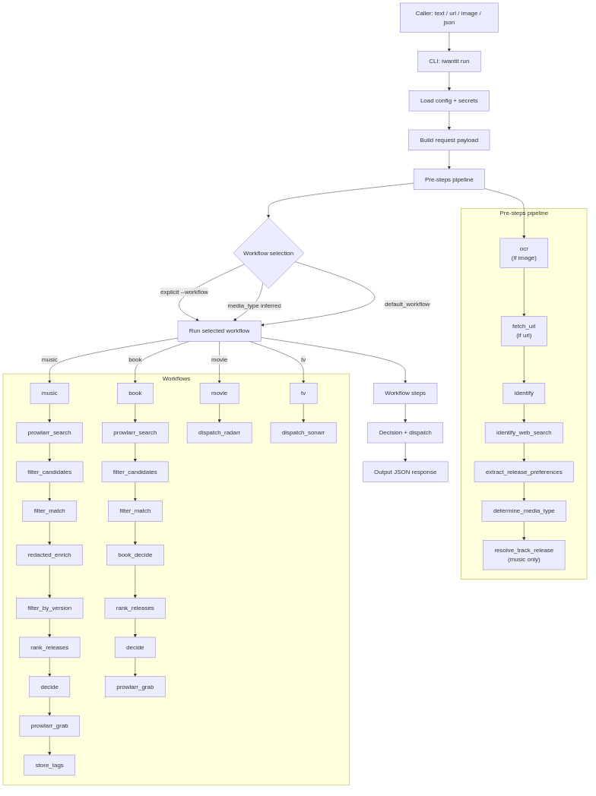
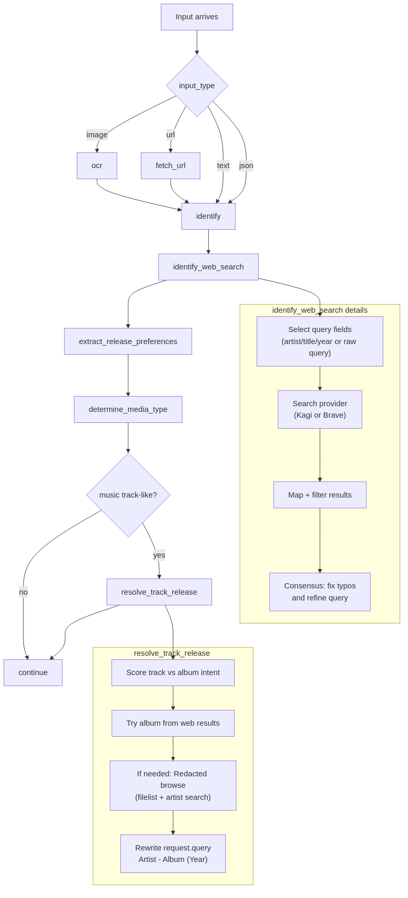
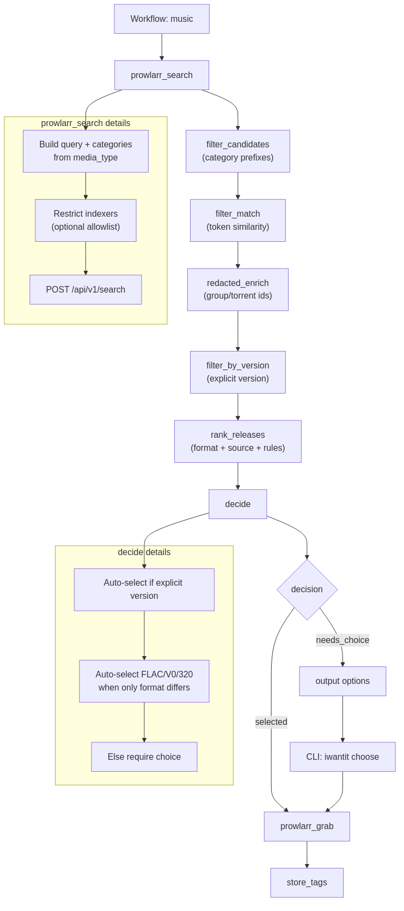
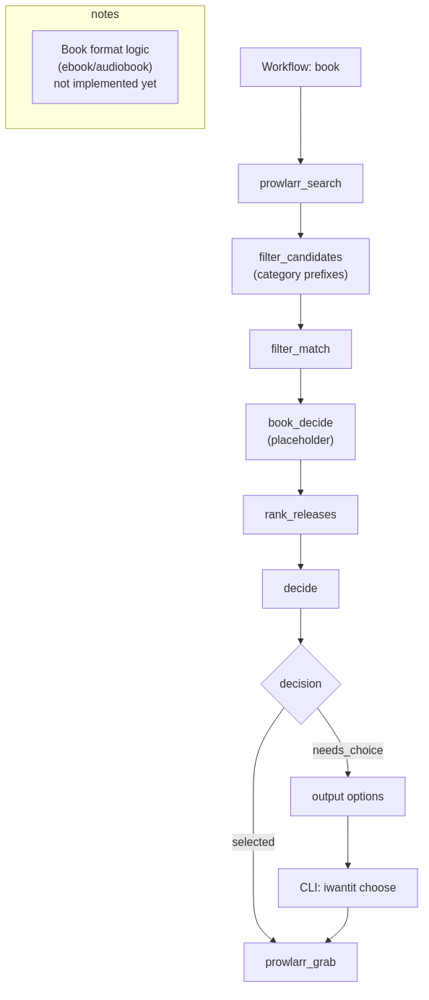
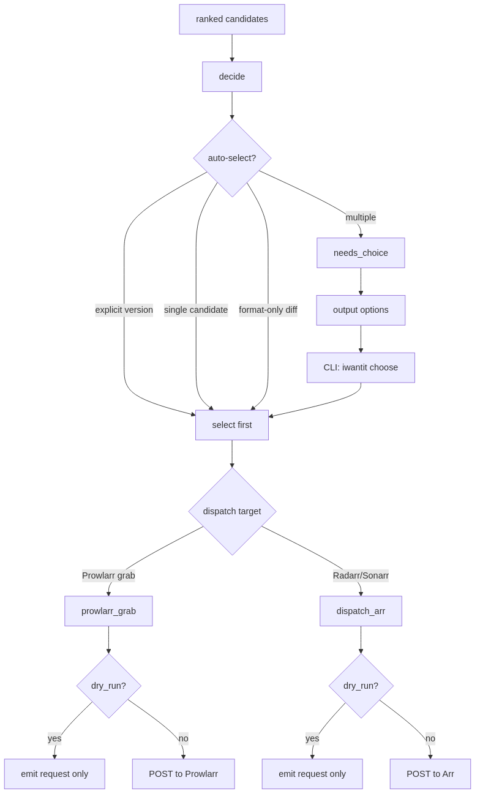

# IWantIt

`iwantit` is a config-driven CLI that turns a URL, text, or screenshot into a clean,
repeatable media workflow. It is designed to be automation-friendly: it reads/writes JSON,
works well in pipelines, and keeps side effects (downloads) isolated to explicit steps.

This repo currently focuses on:
- Music search + downloads via Prowlarr (and Redacted enrichment)
- Movies/TV dispatch to Radarr/Sonarr
- Books via Prowlarr
- Strong defaults for query cleanup, media type detection, and scoring

## Quick start and integrations
Get productive first; customize later.

1) Install and initialize:
```bash
uv tool install .
iwantit init
```

2) Run a safe test:
```bash
iwantit run --text "Pink Floyd - Dark Side of the Moon"
```

3) Allow side effects when you're ready:
```bash
iwantit run --text "Bernard Badie - Bones [2011]" --confirm
```

Integration points (all configurable in `~/.config/iwantit/config.yaml`):
- Prowlarr search + grab (music/books)
- Radarr and Sonarr dispatch (movie/tv)
- Web search providers (Kagi/Brave) for release verification
- Optional tracker enrichment (Redacted)
- Custom HTTP or external command steps

### Help and automation essentials
```bash
iwantit --help
iwantit help overview
iwantit help config
iwantit help config --verbose
iwantit help json
iwantit help safety
iwantit help exit-codes
```

Key automation notes:
- URL-like input is auto-detected even from stdin/JSON.
- Output arrays are compact by default; use `--full` for full items.
- Exit code `20` means `decision.status=needs_choice`.
- `--dry-run` skips side effects; `--confirm` allows them.

### Minimal config template
```yaml
web_search:
  provider: kagi
  providers:
    kagi:
      api_key: ${ENV:KAGI_SEARCH_API_KEY}
prowlarr:
  url: http://localhost:9696
  api_key: CHANGE_ME
arr:
  radarr:
    url: http://localhost:7878
    api_key: CHANGE_ME
    root_folder: /media/movies
    quality_profile_id: 1
    endpoint: /api/v3/movie
  sonarr:
    url: http://localhost:8989
    api_key: CHANGE_ME
    root_folder: /media/tv
    quality_profile_id: 1
    endpoint: /api/v3/series
redacted:
  url: https://redacted.sh
  api_key: CHANGE_ME
```

## How it works (mental model)
The pipeline runs in two phases:

1) **Pre-steps** (normalize + identify)
   - OCR (for screenshots)
   - URL fetching (pulls title/description)
   - Web search cleanup (fix typos, normalize artist/title/year)
   - Media type detection
   - Track-to-album resolution (if input looks like a song)

2) **Workflow steps** (by media type)
   - **Music/Books**: Prowlarr search → filtering → ranking → decision → grab
   - **Movies/TV**: dispatch to Radarr/Sonarr

All steps are configured in YAML. You can replace any step with your own command.

## Diagrams
### Index
- [End-to-end overview](#end-to-end-overview)
- [Pre-steps detail](#pre-steps-detail)
- [Music workflow](#music-workflow)
- [Book workflow](#book-workflow)
- [Movie and TV workflow](#movie-and-tv-workflow)
- [Decision and dispatch logic](#decision-and-dispatch-logic)

### End-to-end overview


Sources: `docs/diagrams/flow-overview.mmd` and `docs/diagrams/rendered/flow-overview.svg`.

### Pre-steps detail


Sources: `docs/diagrams/pre-steps.mmd` and `docs/diagrams/rendered/pre-steps.svg`.

### Music workflow


Sources: `docs/diagrams/music-workflow.mmd` and `docs/diagrams/rendered/music-workflow.svg`.

### Book workflow


Sources: `docs/diagrams/book-workflow.mmd` and `docs/diagrams/rendered/book-workflow.svg`.

### Movie and TV workflow


Sources: `docs/diagrams/movie-tv-workflow.mmd` and `docs/diagrams/rendered/movie-tv-workflow.svg`.

### Decision and dispatch logic


Sources: `docs/diagrams/decision-and-dispatch.mmd` and `docs/diagrams/rendered/decision-and-dispatch.svg`.

## Install (uv)
Install uv first (see https://astral.sh/uv).

### Quick test (no install)
From the repo root:
```bash
uv run python -m iwantit --help
```

### User install (recommended)
```bash
uv tool install .
```
`.` means "install from this local project". This keeps dependencies isolated and exposes `iwantit`
on your PATH. If your shell doesn't see it yet, run:
```bash
uv tool update-shell
```

### Install from git (shareable)
```bash
uv tool install git+https://github.com/<you>/iwantit.git
```

### Development
```bash
uv venv
source .venv/bin/activate
uv pip install -e .
```

### Build & publish (when ready)
```bash
uv build
uv publish
```

## Quick start
If installing locally:
```bash
uv tool install .
```
If `iwantit` isn't found, run:
```bash
uv tool update-shell
```

After publishing to PyPI:
```bash
uv tool install iwantit
```

Then:
```bash
iwantit init

# dry run (no side effects)
iwantit run --text "Pink Floyd - Dark Side of the Moon"

# real run (dispatch/grabs)
iwantit run --text "Bernard Badie - Bones [2011]" --confirm

# URL input
iwantit run --url "https://www.youtube.com/watch?v=naD6-V5CLk0" --dry-run
```

## CLI commands
```bash
iwantit init [--force]
iwantit run [--text|--url|--image|--json|--stdin] [--workflow name] [--dry-run] [--confirm] [--book-format ebook|audiobook|both]
iwantit step <step-name> [--text|--url|--image|--json|--stdin] [--book-format ebook|audiobook|both]
iwantit choose [--json|--stdin] [--interactive] [--select <idx|substring>]
iwantit list workflows|steps
iwantit validate
```

Notes:
- `iwantit run` returns exit code **20** when `decision.status = needs_choice`.
- `iwantit choose` can emit `--choice N` flags for reruns.
- URLs are auto-detected (CLI args, stdin, or JSON input) and treated as `--url`.
- CLI output is compacted by default; use `--full` to emit full JSON.
- Progress messages are written to stderr; use `--quiet` to suppress.
- Dispatch steps are skipped unless you pass `--confirm`.

## Output shape
Every run returns a JSON object:
```json
{
  "request": { "input": "...", "input_type": "text|url|image", "query": "...", "media_type": "music|movie|tv|book" },
  "work": { "candidates": [], "selected": {} },
  "decision": { "status": "selected|needs_choice|error" },
  "search": { "kagi": {}, "prowlarr": {} },
  "dispatch": { "prowlarr": {}, "radarr": {} },
  "tags": {},
  "error": { "message": "...", "step": "...", "type": "..." }
}
```

## Configuration
Config lives at `~/.config/iwantit/config.yaml` (override with `IWANTIT_CONFIG`).
Secrets live at `~/.config/iwantit/secrets.yaml` (override with `IWANTIT_SECRETS`).

### Pre-steps (default)
```
ocr -> fetch_url -> identify -> identify_web_search -> extract_release_preferences
-> determine_media_type -> resolve_track_release
```

#### fetch_url
For URL inputs, `fetch_url` grabs `<title>` and meta description, then uses that
as the query. It also has a YouTube oEmbed fallback to avoid the generic "YouTube" title.

```yaml
steps:
  fetch_url:
    builtin: fetch_url
    timeout: 15
    retries: 1
    retry_backoff_seconds: 0.5
    headers:
      User-Agent: Mozilla/5.0 ...
      Accept-Language: en-US,en;q=0.9
```

#### identify_web_search
Uses a web search provider (Kagi by default) to normalize artist/title/year.
It **does not blindly use the top result**: it builds a consensus from the top N.

```yaml
steps:
  identify_web_search:
    provider: kagi
    result_limit: 10
    min_confirmations: 2
    min_match_ratio: 0.4
```

#### determine_media_type
Uses keywords from web results plus a fallback heuristic (Artist - Title → music, etc.).

```yaml
steps:
  determine_media_type:
    provider: kagi
    min_score: 2
    fallback: true
```

#### resolve_track_release (music only)
If the query looks like a **track**, it attempts to find the **album/EP**:
1) Try to extract album from web snippets (e.g., "from the album ...")
2) If that fails, run **Redacted advanced search** using `artistname + filelist`
3) Rewrite the query to search the album/EP first

```yaml
steps:
  resolve_track_release:
    release_priority: ["Album", "EP", "Single", "Live album"]
```

## Prowlarr integration
Music and book workflows use Prowlarr for search + grab.

```yaml
prowlarr:
  url: http://localhost:9696
  api_key: ${ENV:PROWLARR_API_KEY}
  search:
    indexer_ids:
      music: []   # limit to music trackers
      book: []
    categories:
      music: [3000, 3010, 3040]
      book: [7000]
```

### Download client routing by category
You can auto-select a download client based on Prowlarr categories:

```yaml
prowlarr:
  download_client_rules:
    - client_id: 1
      categories: [3010, 3040, 3050, 3060]
    - client_id: 2
      categories: [3020]
      category_prefixes: [2]  # matches 2xxx
    - client_id: 3
      category_prefixes: [5]  # matches 5xxx
    - client_id: 4
      categories: [3030]
      category_prefixes: [7]  # matches 7xxx
```

Prefix matching is thousands-based by default (`3` → `3000-3999`). You can use
`prefix_mode: "hundreds"` in a rule if you prefer.

### Filtering and matching
The pipeline applies two filters to Prowlarr results:

```yaml
steps:
  filter_candidates:
    allow_missing_categories: false
    category_prefixes:
      music: [30]

  filter_match:
    min_match_ratio: 0.4
    min_token_matches: 2
```

### Book format decision
`book_decide` filters book results when the user specifies a format:
- Query keywords like `audiobook`, `ebook`, `epub`, `m4b` are detected.
- You can also pass `--pref book_format=ebook` or `--pref book_format=audiobook`.
- The default can be set in config via `book.default_format` (ebook, audiobook, or both).

If a format is specified, candidates are filtered to that type; otherwise, all
results remain and the decision step handles selection.

## Redacted enrichment
When a candidate is from Redacted, `redacted_enrich` pulls group/torrent metadata
using the Redacted JSON API. This is used for ranking and for track/album resolution.

Set the API key in secrets:
```yaml
redacted:
  api_key: YOUR_KEY
```

## Ranking and quality rules
`rank_releases` scores candidates using `quality_rules`.

Default music preferences:
- FLAC > V0 > 320
- WEB > CD > SACD > vinyl
- Rejects 24-bit and 5.1/surround

```yaml
quality_rules:
  music:
    release_priority: [deluxe, studio, anniversary, live, bootleg]
    reject:
      - "(?i)\\b24[- ]?bit\\b"
      - "(?i)\\b5\\.1\\b"
    score:
      - { match: "(?i)\\bflac\\b", score: 120 }
      - { match: "(?i)\\bweb\\b", score: 60 }
      - { match: "(?i)\\bcd\\b", score: 40 }
      - { match: "(?i)\\bvinyl\\b", score: -10 }
```

## External steps
Any step can be replaced with a command:
```yaml
steps:
  my_step:
    command: ["python3", "-m", "my.module"]
```
The command receives the JSON payload on stdin and must return JSON to stdout.

## Caching, retries, and timeouts
Most steps support:
```yaml
steps:
  identify_web_search:
    cache: { enabled: true, ttl_seconds: 3600 }
    timeout: 15
    retries: 2
```

Global defaults can be set with `timeouts` and `retries` in config.

## Safety notes
- Prowlarr and Redacted have rate limits. The Redacted API allows ~10 requests/10s with API keys.
- Always respect tracker rules and terms of service.
- This tool is meant for personal automation; you control which indexers and download clients are used.
